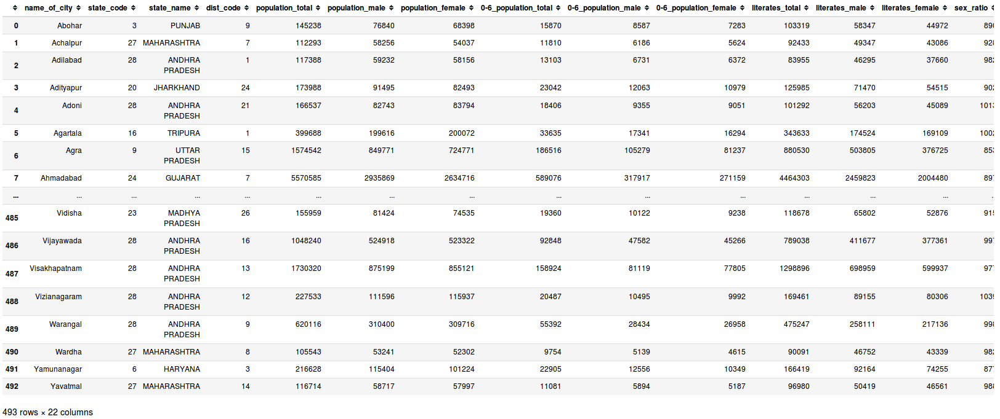
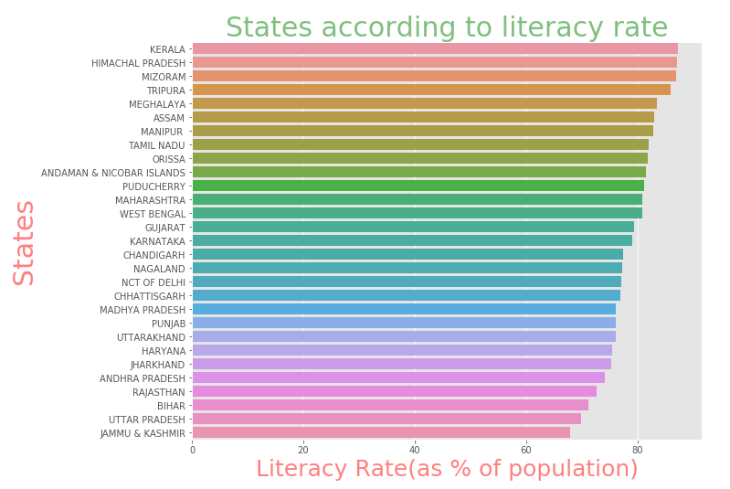
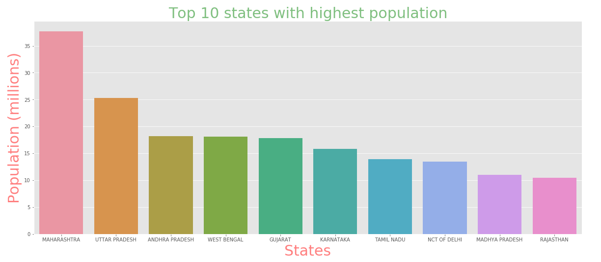
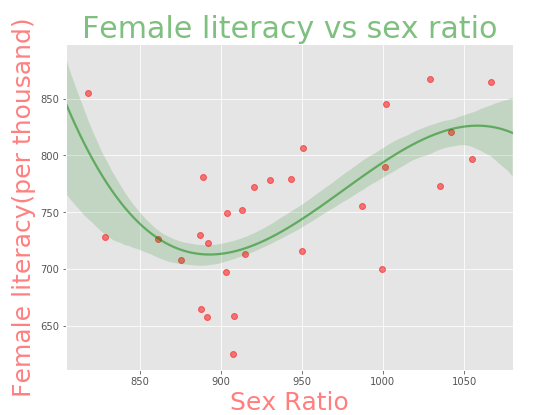

# Simple Data Exploration of Top 500 Indian Cities

## Objective
This repo is about simple data analysis of top 500 Indian cities, their literacy rate, population and sex ratio. By leveraging the wonderful python libraries for data analysis we gain deep insights into the data.

Some areas worth exploring:
* Most populous states
* Male vs female literacy
* States according to liteacy rate
* Relation between sex ratio and literacy
* States according to number of cities

## Data Decription (as available on Kaggle)
> Dataset can be downloaded from  [here](https://www.kaggle.com/zed9941/top-500-indian-cities)

### Context
this data set is created by merging **the census 2011 of Indian Cities with Population more than 1 Lac** and **City wise number of Graduates from the Census 2011**, to create a visualization of where the future cities of India stands today, I will try to add more columns [ fertility rate, religion distribution, health standards, number of schools, Mortality rate ] in the future, hope people will contribute.

## Prerequiste
1. Python 3
2. Jupyter Notebook
3. Pandas (for data analysis)
4. Numpy
5. Matplotlib (for visualization)
6. Seaborn (for visualization)

### View the [Notebook](top500indiancities.ipynb)

## How to run the Notebook
1. Download and install [Anaconda](https://anaconda.org). It contains all the relevant packages mentioned in Prerequiste section
2. Download the [dataset](https://www.kaggle.com/zed9941/top-500-indian-cities) and this repository
3. Open terminal/command prompt and navigate to the downloaded repository, then run "jupyter notebook" command in the terminal
4. Jupyter file explorer will open in the browser. Click on the notebook then run Cell-->Run All from the menu.

### Data view

---
## Plots from notebook
### States according to literacy

---

### Top 10 states with highest population

---

### Female literacy vs sex ratio

